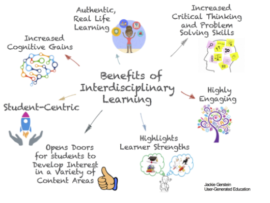
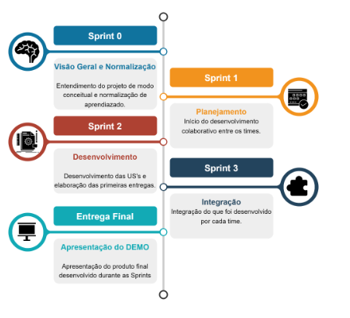
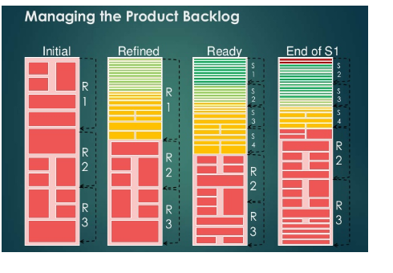

<figure>
  <div align="center">
    
    <br/>
  </div>
</figure>

## **Projeto AFA-BD (AnáLise de Fluência na Alfabetização em Big Data)**

### **Sumário**

- [Introdução](#introdução)
- [Interdisciplinary Problem Based Learning](#interdisciplinary-problem-based-learning)
- [Disciplinas](#disciplinas)
- [Desenvolvimento Agile](#desenvolvimento-agile)
- [Scrum Master](#scrum-master)
- [Product Owner](#product-owner)
- [Documentação do Projeto](#documentações-do-projeto)
    - [Atas de Reuniões](#atas-de-reuniões)
    - [Product Backlog](#product-backlog)
    - [Casos de Testes](#casos-de-testes)
    - [Gráfico Burndown](#gráfico-burndown)
    - [Relatórios Sintéticos Individuais](#relatórios-sintéticos-individuais)
    - [Relatórios Sintéticos das Sprints dos Times Scrum](#relatórios-sintéticos-das-sprints-dos-times-scrum)
    - [Apresentação](#apresentação)
    - [Vídeo](#vídeo)
- [Dicas de Trabalho](#dicas-de-trabalho)
    - [Trabalhando com User Storys](#trabalhando-com-user-storys)
    - [Controle de branches](#controle-de-branches)
    - [Mensagem de commit](#mensagem-de-commit)
    - [Definition of Ready](#definition-of-ready)
    - [Definition of Done](#definition-of-done)
- [Referências](#referências)

### **Introdução**

O Programa Mais Alfabetização (PMALFA) foi instituído pelo Ministério da Educação (MEC) através da Portaria MEC no 142/2018, com o propósito de fortalecer e apoiar unidades escolares no processo de alfabetização de alunos matriculados no 1º e 2º ano do ensino fundamental.

O objetivo principal do programa é proporcionar métricas confiáveis para avaliar o nível de alfabetização no Brasil, buscando contribuir tanto para o aprimoramento dos estudantes quanto para a qualidade do ensino. Ao oferecer suporte às escolas e infraestruturas de redes municipais e estaduais, o MEC busca criar uma base sólida para que os alunos desenvolvam habilidades de leitura e escrita desde os primeiros anos de sua educação.

O PMALFA assume uma abordagem colaborativa e inovadora ao envolver os alunos das disciplinas relacionadas, orientados por professores, para desenvolverem soluções que abrangem conceitos de Qualidade, Confiabilidade e Segurança de Software, bem como Sistemas Embarcados de Tempo Real e Tópicos Avançados em Teste de Software. Essa abordagem visa não apenas fortalecer a alfabetização, mas também promover a excelência educacional por meio de práticas ágeis e eficazes.

Em resumo, o Programa Mais Alfabetização é uma estratégia do Ministério da Educação para apoiar o processo de alfabetização no Brasil. Buscando fornecer métricas confiáveis, o programa envolve alunos e professores em uma abordagem inovadora para promover a qualidade da educação e o desenvolvimento das habilidades de leitura e escrita dos estudantes no início de sua jornada acadêmica.

### **Interdisciplinary Problem Based Learning**
A Metodologia Interdisciplinary Problem Based Learning (IPBL) é um enfoque pedagógico que busca promover a aprendizagem ativa e significativa dos estudantes, envolvendo-os em situações reais e desafiadoras para resolver problemas complexos.

Essa metodologia tem como princípio central a interdisciplinaridade, ou seja, a integração de conhecimentos e abordagens de diferentes disciplinas acadêmicas para abordar e solucionar problemas do mundo real. Ela vai além do ensino tradicional, que muitas vezes segmenta o conhecimento em disciplinas isoladas, e propõe uma abordagem holística, onde os alunos são incentivados a utilizar uma variedade de habilidades e conhecimentos de diferentes áreas para resolver problemas complexos.

<figure>
  <div align="center">
    
</figure>

Essa abordagem é amplamente utilizada em instituições de ensino superior, especialmente em cursos que requerem uma compreensão profunda e prática do conhecimento em contextos do mundo real, como cursos de engenharia, ciências aplicadas, medicina e áreas relacionadas.

A Metodologia Interdisciplinary Problem Based Learning incentiva uma aprendizagem mais profunda, o desenvolvimento de habilidades essenciais e uma visão mais ampla e conectada do conhecimento, preparando os estudantes para enfrentar os desafios do mundo atual e futuras carreiras de forma mais completa e bem-sucedida.

### **Disciplinas**

Todas as informações referêntes ao AFA-BD e as disciplinas estão disponívels no [Portal do Projeto](https://sites.google.com/view/projeto-afa-bd/home?authuser=0), para facilitar o encontro das informações específicas das matérias, pode-se utilizar os links abaixo.

- [CE-240 - Projeto de Sistemas de Banco de Dados)](https://sites.google.com/view/projeto-afa-bd/disciplinas/ce-240?authuser=0)
- [CE-245 - Tecnologias da Informação)](https://sites.google.com/view/projeto-afa-bd/disciplinas/ce-245?authuser=0)
- [CE-229 - Teste de Software)](https://sites.google.com/view/projeto-afa-bd/disciplinas/ce-229?authuser=0)

### **Desenvolvimento Agile**

Para propósitos acadêmicos, os times serão segmentados em ALUNOS e PROFESSORES, bem como em ESCOLAS e INFRAESTRUTURA, com base nos conhecimentos adquiridos nas três disciplinas. Serão adotadas boas práticas de metodologia ágil, focando em três Pilares: Transparência, Inspeção e Adaptação.

Visando a verificação e validação do processo de análise de fluência em leitura para determinar o nível de alfabetização de alunos do primeiro ou segundo ano do ensino fundamental, será utilizado o Projeto Análise de Fluência na Alfabetização versão 3.0 Banco de Dados (ALFA3-BD) em uma Missão Atribuída. O funcionamento das fases para cada Sprint será descrito para assegurar a eficácia do processo.

Nessa abordagem, o foco estará em aplicar conhecimentos, promover a colaboração e cooperação entre alunos e professores, e garantir a eficiência no processo de análise de fluência em leitura para melhor avaliar o nível de alfabetização dos estudantes. As ações seguirão uma estrutura ágil para otimizar o desenvolvimento e a verificação dos resultados alcançados no Projeto Análise de Fluência na Alfabetização.

<figure>
  <div align="center">
    
</figure>

Com base na imagem acima, que apresentará um pipeline do desenvolvimento das Sprints, será possível verificar que o desenvolvimento terá início na Sprint 0. Nessa etapa, os alunos de cada disciplina compreenderão o funcionamento da metodologia ágil, os artefatos associados e receberão uma contextualização do projeto. Em seguida, na Sprint 1, ocorrerá a divisão dos times e a distribuição das tarefas para cada equipe, com o planejamento e entendimento da problemática a ser abordada.

A Sprint 2 será focada no desenvolvimento do produto, na qual os times se concentrarão em entregar valor ao produto final. Na sequência, a Sprint 3 será dedicada à integração, na qual os times se unirão para consolidar todos os desenvolvimentos realizados nas Sprints anteriores.

Por fim, na entrega final, ocorrerá a apresentação do produto e do que foi possível realizar durante as 16 semanas acadêmicas. Esse processo seguirá uma abordagem ágil, possibilitando maior agilidade e eficiência na conclusão do projeto, garantindo assim uma experiência mais bem-sucedida para todos os envolvidos.

### **Scrum Master**
O Scrum Master é responsável por facilitar o processo Scrum e garantir que a equipe esteja seguindo os princípios e práticas ágeis. Ele também é responsável por remover obstáculos que possam impedir a equipe de atingir seus objetivos. O Scrum Master é um facilitador e não um gerente. Ele não define o trabalho que a equipe deve realizar, mas sim ajuda a equipe a definir o trabalho e a se organizar para executá-lo.

- Facilitar o processo Scrum;
- Garantir que a equipe esteja seguindo os princípios e práticas ágeis;
- Remover obstáculos que possam impedir a equipe de atingir seus objetivos;
- Treinar a equipe sobre Scrum;
- Monitorar o progresso da equipe e fornecer feedback;
- Representar a equipe para o cliente e outros interessados.

### **Product Owner**
O Product Owner (PO) é o responsável por definir a visão e o planejamento do produto. Ele é o representante do cliente ou do usuário final e é responsável por garantir que o produto atenda às suas necessidades. O PO trabalha em estreita colaboração com a equipe de desenvolvimento para definir as funcionalidades do produto, priorizar o trabalho e garantir que o produto seja entregue no prazo e dentro do orçamento.

- Definir a visão e o planejamento do produto;
- Priorizar o trabalho;
- Trabalhar com a equipe de desenvolvimento para definir as funcionalidades do produto;
- Garantir que o produto atenda às necessidades do cliente;
- Comunicar com o cliente sobre o progresso do produto;
- Obter feedback do cliente sobre o produto.

### **Documentações do Projeto**
Dentro das Sprints serão necessários apresentar os seguintes documentos para ambos os times Scrum

#### Atas de Reuniões

As atas de reuniões consistem em documentos onde cada aluno registra sua presença e compreensão dos tópicos discutidos durante as weekly meetings. Esses documentos são geralmente administrados pelo Scrum Master. Você pode encontrar o modelo para esse documento [aqui](https://docs.google.com/document/d/1vWW60Ie0ax99eGwVFG0rd8BSnYG50K8r/edit). Certifique-se de incluir um link para a gravação da reunião. Tanto a ata quanto a gravação devem ser armazenados de forma adequada na pasta do projeto no Google Drive, organizados por Sprints. A estrutura hierárquica pode ser observada abaixo:

```
AFA-BD
└── 04_Desenvolvimento_Repositório_Sprints
    └── 01_Repositório dos Times Scrum
        └── 01_TS01
            ├── Sprint_01
            │   ├── 01_Atas
            │   ├── 02_Documentos
            │   └── 04_Videos
            └── Sprint_02
                ├── 01_Atas
                ├── 02_Documentos
                └── 04_Videos
        └── 02_TS01
            └── Sprint_01
                ├── 01_Atas
                ├── 02_Documentos
                └── 04_Videos
            └── Sprint_02
                ├── 01_Atas
                ├── 02_Documentos
                └── 04_Videos
        └── 05_Product Owner
```

#### Product Backlog

O Product Backlog é uma lista completa dos requisitos do produto, abrangendo funcionalidades, correções de bugs e melhorias. Esta lista é crucial para a gestão de projetos ágeis, assegurando que todos os requisitos sejam considerados e que o desenvolvimento do produto esteja alinhado com as necessidades do cliente. O template está disponível [neste link](https://docs.google.com/spreadsheets/d/1OxP5Ouk_ta7wpvM0LPVzL3W297tFnVid/edit#gid=627751163).

#### Casos de Testes

Os casos de teste de software, elaborados pelos membros da disciplina CE-237 (Tópicos Avançados em Teste de Software), devem ser detalhados com base em um modelo acessível [neste link](https://docs.google.com/spreadsheets/d/1SgkikAk3lCVu40swyBkm_4TyRPmkaG1L/edit#gid=1778864658). Além disso, é necessário incluir os casos de teste no artefato de backlog correspondente à respectiva sprint.

#### Gráfico Burndown

O gráfico burndown é uma ferramenta empregada para monitorar o progresso da equipe ao longo da Sprint. Ele representa a quantidade de trabalho remanescente versus o tempo restante no projeto. Siga o template disponível [neste link](https://docs.google.com/spreadsheets/d/1qou26gVSFXD8aBTBSSPUxs_K_KObJnTR/edit#gid=1744797886) para criar o gráfico.

#### Relatórios Sintéticos Individuais

Após cada sprint, cada membro da equipe Scrum deve redigir e disponibilizar um relatório sintético individual em seu respectivo site no Google. Esse relatório deve descrever as tarefas realizadas pela equipe durante a sprint, além de oferecer uma visão mais aprofundada das contribuições individuais. O modelo para esse relatório está disponível [aqui](https://docs.google.com/document/d/14EYYE6kVxuu7826x_aIOeaHygXN8v8Oo/edit).

#### Relatórios Sintéticos das Sprints dos Times Scrum

Ao final de cada sprint, cada time Scrum deve criar e disponibilizar um relatório sintético do time. Esse relatório deve abordar as tarefas realizadas durante a sprint e pode ser organizado na pasta correspondente no Google Drive do projeto. O modelo para esse relatório pode ser encontrado [aqui](https://docs.google.com/document/d/1XWvzIVBMnBAl8GLNYI7t-WXX9s7KHFNl/edit).

#### Apresentação

No término de cada sprint, é necessário que cada equipe Scrum prepare uma apresentação em PowerPoint que demonstre o progresso alcançado durante a sprint. Essa apresentação deve ser disponibilizada na pasta correspondente no Google Drive do projeto. O template para a apresentação pode ser acessado [aqui](https://docs.google.com/presentation/d/1PaZY2ij3IImZItFp0SuX2hJ2Xf8efBwq/edit#slide=id.p1).

#### Vídeo

Ao fim de cada sprint, a equipe Scrum é responsável por criar um vídeo de aproximadamente 5 mais ou menos 2 minutos, detalhando o progresso realizado durante a sprint. Não há um modelo específico para isso, e as ferramentas utilizadas podem variar de acordo com a equipe. Recomenda-se tomar como referência os vídeos criados em projetos anteriores, como por exemplo, o [vídeo de apresentação final](https://drive.google.com/file/d/18OleFukfmto69FV2-OyJerTDBQ-cix5F/view?resourcekey) do projeto ALFA3-BD.

### **Dicas de Trabalho**

Importante ressaltar que a princípio, embora existam divisões de disciplinas, todo desenvolvedor deve se importar com a organização do repositório e com a qualidade de suas entregas, para facilitar a comunicação será proposto algumas dicas de trabalho para evitar componentes indesejados e falta de clareza ao avaliar o código e sua documentação.

#### **Trabalhando com User Storys**
A User Story descreve uma funcionalidade que tenha valor para o cliente. Por isso, é importante seguir os critérios INVEST:

| Componente   | Descrição                                                     |
|--------------|---------------------------------------------------------------|
| Independent  | Capaz de ser implementado de forma independente, sem depender de outras tarefas, permitindo a execução em qualquer ordem.   |
| Negotiable   | Flexível e sujeito a negociação durante o desenvolvimento, permitindo ajustes conforme as necessidades e prioridades do cliente. |
| Valuable     | Oferece valor significativo ao cliente, atendendo suas necessidades e expectativas para alcançar os objetivos do projeto. |
| Estimatable  | Possível de ser estimado em termos de esforço e tempo, permitindo a priorização e o planejamento adequado das atividades.   |
| Small        | Pequeno em escopo e com uma descrição concisa, facilitando a compreensão e tornando-o mais gerenciável durante o desenvolvimento. |
| Testable     | Permite a criação de testes para verificar sua funcionalidade e qualidade, garantindo sua correta implementação e integração. |

Exemplo de template para criação das US

```
Título: (Um resumo conciso e descritivo da User Story)

Descrição:
Como um (tipo de usuário),
Eu desejo (objetivo/necessidade do usuário)
Para que (benefício/resultados esperados).

Critérios de Aceitação:

(Critério 1 - O que deve ser atendido para considerar a User Story concluída)
(Critério 2 - Outro requisito importante a ser cumprido)
(Critério 3 - Mais um requisito ou condição específica)
```

Definição de Pronto

- Os critérios de aceitação foram atendidos.
- A User Story foi revisada e testada.
- Aprovada pelo Product Owner.

#### **Controle de branches**

<figure>
  <div align="center">
    
    <br/>
    <figcaption style="font-size: 16px; font-weight: bold;">
      How to work in multiple git branches simultaneously
    </figcaption>
  </div>
</figure>

O uso de branches no Git é uma prática essencial para promover a colaboração, cooperação, organização e o controle eficiente de versões em projetos de desenvolvimento de software. Ele facilita o trabalho em equipe, evita conflitos, promove a revisão de código e permite uma abordagem mais estruturada para desenvolver e manter projetos de forma controlada e organizada. Afim de padronizar o trabalho com as branches, será proposto o padrão demonstrado na imagem acima, com as seguintes observações:

| Branch     | Descrição                                                                                    |
|------------|----------------------------------------------------------------------------------------------|
| main       | A branch principal, também conhecida como master ou mainline, que representa a versão estável e pronta para produção do código. |
| hotfix     | Utilizada para correção de bugs críticos encontrados na branch main, permitindo atualizações rápidas sem interferir no desenvolvimento em andamento. |
| release    | Prepara o código para uma nova versão estável, incorporando as últimas funcionalidades e correções. Essa branch é testada e, se aprovada, é mesclada na main. |
| develop    | Representa o ramo de desenvolvimento ativo, onde as novas funcionalidades são incorporadas e testadas antes de serem mescladas na release ou main. |
| feature    | Cada funcionalidade ou tarefa específica a ser desenvolvida é criada em uma branch feature individual. Após a conclusão, é mesclada na develop. |

Para criação das branches use o formato `<tipo>-<jira-id>`, por exemplo `hotfix-cap-87`. Caso seja de interesse, pode saber mais acessando o [link para o artigo](https://gitbetter.substack.com/p/how-to-work-in-multiple-git-branches).
 
#### **Mensagem de commit**

Se você navegar no log de qualquer repositório Git aleatório, provavelmente descobrirá que suas mensagens de commit são mais ou menos uma bagunça, por isso uma mensagem de commit do Git bem elaborada é a melhor maneira de comunicar o contexto sobre uma mudança a outros desenvolvedores. Um diff dirá o que mudou, mas apenas a mensagem de commit pode dizer o porquê. Pode ler mais sobre isso em [How to Write a Git Commit Message](https://cbea.ms/git-commit/)

Dados isso, é proposto a utilização so seguinte padrão para mensagens de commit:

```
Título do commit
Sempre use o modo imperativo para o título. Mantenha curto e conciso e não ultrapasse 50 caracteres.

Corpo do commit
Descreva seu commit com mais detalhes. Explique o quê e por quê versus como. 

Jira: JIRAID-123 Título do Jira
Isso ajuda a rastrear cada confirmação de um card do Jira. Se o Jira fizer parte de um recurso maior que foi dividido, use sempre o mais detalhado. Portanto, apenas Tarefas, Subtarefas, Histórias ou Bugs devem ser mencionados aqui. Você pode mencionar vários Jiras. Isso é comum, por exemplo, ao alterar versões de dependência.
```

#### **Definition of Ready**
O DoD é um checklist que indica para o time que a US está PRONTA para ser ENTREGUE, ou seja, todas as atividades de desenvolvimento e testes foram executadas.

Segue a DoR definida para o projeto:

- **A US está definida?**
  - É isso que o cliente quer que seja implementado?
  - A US está alinhada com o produto final?
- **Os critérios de aceitação estão definidos?**
  - O critério de aceitação está claro para o time?
- **As dependências foram identificadas?**
  - Existe algum impedimento que precisa ser resolvido? Ele está mapeado?
- **O time aceitou as definições?**
  - O time entendeu tudo o que precisa ser realizado?

*Observações*:
- Escreva a US utilizando o método INVEST, pois ela resolve praticamente toda a DoR;
- Se a US não cumprir as exigências da DoR ela não pode ser colocada no Sprint Backlog;
- Não espere a Sprint Planning para elaborar as próximas US, realize esse trabalho constantemente;
- As USs que estiverem de acordo com a DoR, devem ser colocadas na parte de cima do Product Backlog, conforme a coluna Ready da figura abaixo:


<figure>
  <div align="center">
    
</figure>

#### **Definition of Done**

O DoD é um checklist que indica para o time que a US está PRONTA para ser ENTREGUE, ou seja, todas as atividades de desenvolvimento e testes foram executadas.

Segue a DoD definida para o projeto:

- A codificação está completada?
- O código está integrado no repositório github?
- Todos os testes passaram?
- Os critérios de aceitação foram cumpridos?
- A documentação está finalizada?
- O vídeo da funcionalidade foi publicado?

*Observações*: 
Sem a DoD a US não pode ser considerada entregue para o Product Owner.

### **Referências**

[1] - [Kanbam e Scrum, obtendo o melhor de ambos](https://drive.google.com/file/d/1DYlJvjCaTn14KUZ9Vjdkejx2TU9-zBW1/view?usp=drive_link);

[2] - [Scrum e XP direto das trincheiras](https://drive.google.com/file/d/1bbd7tWWSxEBR2r3GLH_YkntOGfjYHits/view?usp=drive_link);
